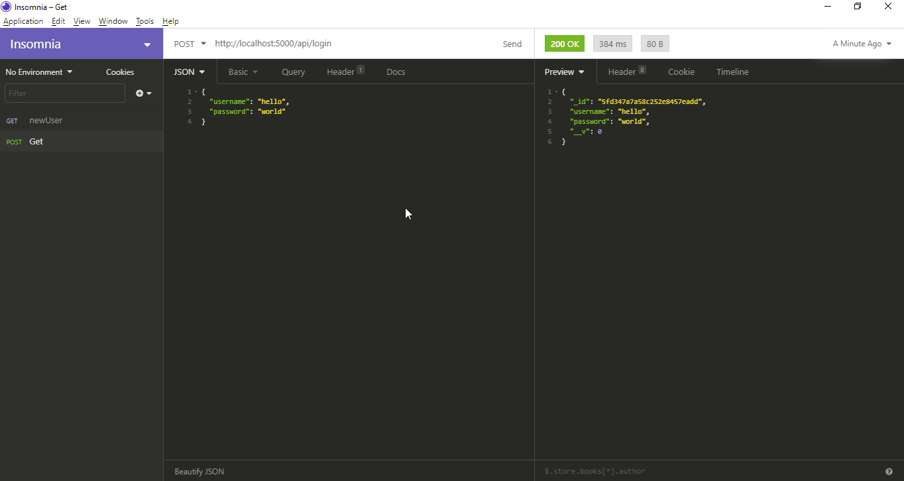

## Passportjs LocalStrategy Authentication Without Session with Expressjs or Nodejs

**Why without Session?**

This is for learning step by step if you coming from JWT authentication without having session auth knowledge. Passportjs documentation is not good in my opinion. Especially the `passport-local` is hard to undertand. So, To understand how things playing out with mongoose I ignored session.

This repo is basically about validating users with Passportjs without any extra layer or cookie session.

Detailed explaination in Code comments.

